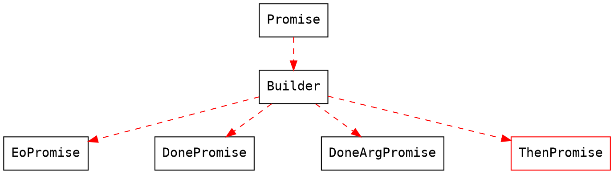
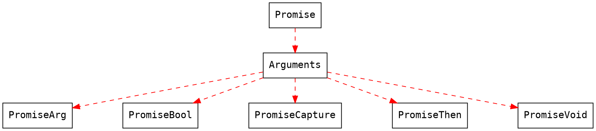

# Promise

## POM

```xml
<dependency>
  <groupId>io.enoa</groupId>
  <artifactId>enoa-promise</artifactId>
  <version>1.6-beta.2</version>
</dependency>
```

## 说明

Promise 是 Enoa 中一个比较特别的组件, 其作用和 Javascript 中的 Promise 相似. 为了提供更直观的异步调用语法. Promise 通常不会被单独使用, 而是为其他项目提供异步 Promise 支持. 例如 [Http Client](#Http-Client).

在说明 Promise 之前, 我们先看看 Javascript 的 Promise, 如果你本来就了解那最好了. 因为于其非常相似.
Javascript 中 Promise 的一个代表的库是 [Fetch](https://github.github.io/fetch/ "Fetch").
一个富有代表性的 Fetch 请求案例.

```javascript
// request a url
fetch('https://httpbin.org/get')
  // respoonse to json
  .then(resp => resp.json())
  // print json
  .then(ret => console.log('response: ', ret))
  // catch exception
  .catch(e => console.log('parsing failed', ex))
  // finally block
  .finally(() => console.log('finally'));
```

虽然这篇文章不是想要告诉你 Fetch 怎么用, 但是, 如果能理解 Fetch 的用法, 对 Promise 的理解会很有帮助, 就简单的来分析下 Fetch 的用法吧.

这段代码共 5 行, 第一行 `fetch('https://httpbin.org/get')` 发送一个请求, 接下来有两个 `.then`, 第一个 then 将请求返回的 `resp` 转换为 json 数据, 表明该请求返回的数据是 json 结构, 第二个 then 打印这个 json, 接下来是 catch, 以及 finally, 简单来说就是 catch 会捕捉请求以及 then 中的代码执行错误抛出的 Exception, 并进行打印, 如果没有抛出将不会被执行, finally 的作用和 try 语句块的 finally 的作用相同, 无论执行成功或失败, 最终都会执行的语句.

好, 相信你已经知道 Fetch 怎么用, 那么来看看 Enoa 提供的 Http Client 的用法, 当然这里只是提出用法, 具体分析可见 [Http Client](#Http-Client).

```java
Http.request("https://httpbin.org/get")
  .method(HttpMethod.GET)
  .enqueue()
  .then(HttpResponse::body)
  .execute(System.out::println)
  .capture(System.err::println)
  .always(() -> System.out.println("finally"));
```

先不要执着于这段代码, 只需要知道, 这段代码于 Fetch 的目的相同, 为了更直观的体现出异步请求的代码实现.

事实上, Promise 出现的目的就是为了解决异步操作上的回调地狱问题, 其在 Javascript 中已经表现的很出色. 当然在 Java 中也是可以实现的.
那么我们来看看 Enoa 中 Promise 应该怎么用.

Promise 提供了几种不同接口, 根据合适的情况选择, 当然也可以自己进行扩展.


## Builder



- EoPromise
  - capture
  - always
- DonePromise
  - capture
  - always
  - done
- DoneArgPromise
  - capture
  - always
  - done
- ThenPromise
  - 下个版本开放

## Arguments



## 使用

要实现 Promise 的功能, 在上方图表中列出的 Builder 以及 Arguments 接口进行组合即可. 这里实现一个简单的 DonePromise:

```java
public class Writer {

  private static ExecutorService ENQUEUE = PromiseBuilder
    .executor()
    .enqueue("DonePromise Enqueue Dispatcher");

  public static DonePromise write(EnoaBinary binary) {
    EPDonePromiseBuilder builder = PromiseBuilder.done();
    ENQUEUE.execute(() -> {
      try {
        FileKit.write(Paths.get("/tmp/test.txt"), binary.bytebuffer());

        if (CollectionKit.notEmpty(builder.dones())) {
          for (PromiseVoid done : builder.dones()) {
            done.execute();
          }
        }
      } catch (Exception e) {
        if (CollectionKit.notEmpty(builder.captures())) {
          for (PromiseCapture capture : builder.captures()) {
            capture.execute(e);
          }
        }
      } finally {
        if (builder.always() != null)
          builder.always().execute();
      }
    });
    return builder.build();
  }

}
```

调用

```java
Writer.write(EnoaBinary.create("Hello World".getBytes()))
  .done(() -> System.out.println("Write file done."))
  .done(() -> System.out.println("And do other thing."))
  .capture(e -> System.err.println(e.getMessage()))
  .capture(e -> System.err.println(ThrowableKit.string(e)))
  .always(() -> System.out.println("finally"));
```

这样, 我们就完成了一个返回 Promise 的异步文件写入方法.

实现 Promise 的关键点在于 Builder 中, 对 Arguments 的不同类型组装, 以及方法中如何调用, Promise 包中提供的几种 Builder 仅仅是比较普遍的运用情况, 如果有特殊的需求, 你可以自己去实现一个 Builder 来创建 Promise, 一个比较完善的自定义 Promise 案例是 HttpPromise

[HttpPromise](https://github.com/fewensa/enoa/blob/master/enoa-http/src/main/java/io/enoa/http/protocol/HttpPromise.java "HttpPromise.java")
[HttpHelper implement](https://github.com/fewensa/enoa/tree/master/enoa-http/src/main/java/io/enoa/http/provider/httphelper/async)

HttpPromise 提供了很多有趣的用法, 具体用法参见 [Http Client](#Http-Client)

